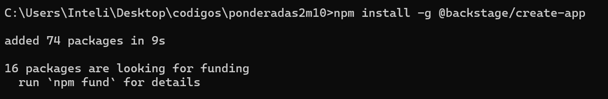
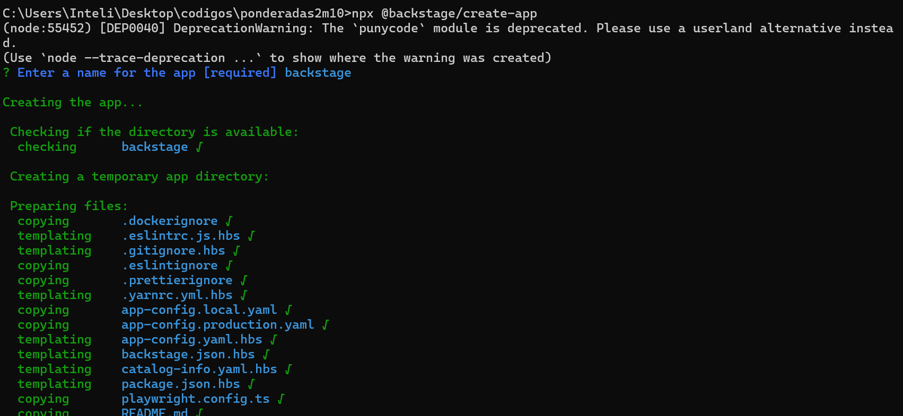
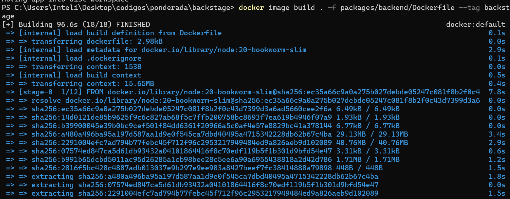
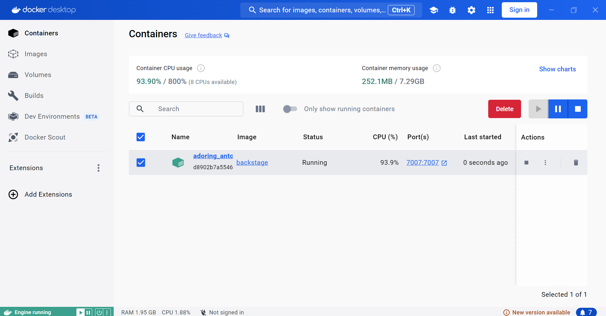

# Backstage com Docker

## O que é o Backstage?

O **Backstage** é uma plataforma de código aberto desenvolvida pela Spotify que facilita a criação de portais internos de desenvolvedores. Ele ajuda equipes a centralizar ferramentas, serviços e documentação em um só lugar, simplificando a organização de projetos e a produtividade da equipe.

Com o Backstage, é possível gerenciar microserviços, bibliotecas, APIs, documentos e muito mais, proporcionando uma interface amigável para navegação e uso dessas ferramentas.

---

## O que é Docker?

O **Docker** é uma plataforma que permite criar, gerenciar e executar aplicações em contêineres. Esses contêineres empacotam todos os arquivos e dependências necessários para que uma aplicação rode de maneira consistente em qualquer ambiente, seja no seu computador local ou em servidores de produção.

### O que é uma Imagem Docker?

Uma **imagem Docker** é um pacote leve, executável, contendo tudo o que é necessário para rodar um software: código, bibliotecas, variáveis de ambiente, configurações e dependências. Quando você constrói uma imagem Docker, ela pode ser executada em qualquer máquina que tenha Docker instalado, garantindo que sua aplicação funcione de forma idêntica em diferentes ambientes.

A **importância da imagem Docker** reside na sua capacidade de garantir portabilidade, consistência e escalabilidade, eliminando problemas relacionados a dependências e ambientes incompatíveis.

---

## Passo a Passo: Configuração e Execução do Backstage com Docker

### 1. Instalação do Yarn

O **Yarn** é um gerenciador de pacotes rápido e confiável, utilizado para instalar dependências JavaScript.

#### Passos para Instalar o Yarn:

1. Primeiro, instale o **Node.js**, pois o Yarn depende dele. [Baixe aqui](https://nodejs.org/).
2. Após a instalação do Node.js, abra o terminal e execute:

   ```bash
   npm install --global yarn
   ```

3. Verifique a instalação:

   ```bash
   yarn --version
   ```

---

### 2. Instalação do Docker

O **Docker** é necessário para rodar o Backstage em contêineres.

#### Passos para Instalar o Docker:

1. Acesse o site oficial do Docker e siga o guia de instalação para seu sistema operacional: [Docker Download](https://www.docker.com/get-started).
2. Após a instalação, execute o seguinte comando para verificar se o Docker está funcionando corretamente:

   ```bash
   docker --version
   ```

---

### 3. Instalação do Backstage

Agora que o Yarn e o Docker estão configurados, vamos instalar o **Backstage**.

#### Passos para Instalar o Backstage:

1. Crie um novo diretório para o projeto:

   ```bash
   mkdir my-backstage-app
   cd my-backstage-app
   ```
   

2. Use o comando do Backstage CLI para criar um novo projeto:

   ```bash
   npx @backstage/create-app
   ```

      

      


   Isso criará uma nova aplicação Backstage no diretório atual.

3. Instale as dependências necessárias com Yarn:

   ```bash
   cd my-backstage-app
   yarn install
   ```

4. Compilar o projeto para prepará-lo para rodar em produção:

   ```bash
   yarn build
   ```

---

### 4. Executando o Backstage no Docker

Agora que o Backstage está configurado, vamos construir e rodar a aplicação em um contêiner Docker.

#### Passos para Rodar o Backstage com Docker:

1. **Criação da Imagem Docker:**

   Dentro do diretório do Backstage, utilize o comando abaixo para construir a imagem Docker:

   ```bash
   docker build -t backstage-app .
   ```


   Isso criará a imagem Docker do Backstage, baseada no Dockerfile presente no projeto.

      


2. **Executando a Imagem Docker:**

   Agora, rode a imagem que você acabou de criar:

   ```bash
   docker run -d -p 7007:7007 backstage-app
   ```

   Esse comando irá iniciar o Backstage no Docker e disponibilizá-lo localmente na porta 7007.

   


---

# Conclusão

 Backstage facilita a centralização de ferramentas e a organização de serviços dentro de uma empresa, promovendo maior eficiência e colaboração entre equipes de desenvolvimento. Além disso, vimos como o Docker, ao criar uma imagem da aplicação Backstage, proporciona uma maneira consistente e confiável de executar o portal em qualquer ambiente.

O uso de uma imagem Docker para o Backstage garante que todo o ambiente de desenvolvimento seja replicado com precisão, eliminando os problemas relacionados a dependências ou configurações locais. Isso permite que o Backstage rode de forma previsível, seja em uma máquina local, em um servidor remoto ou em um cluster de contêineres. O Docker facilita não apenas a distribuição da aplicação, mas também a sua escalabilidade e manutenção, tornando o gerenciamento do Backstage simples e eficiente para equipes de DevOps e desenvolvimento.